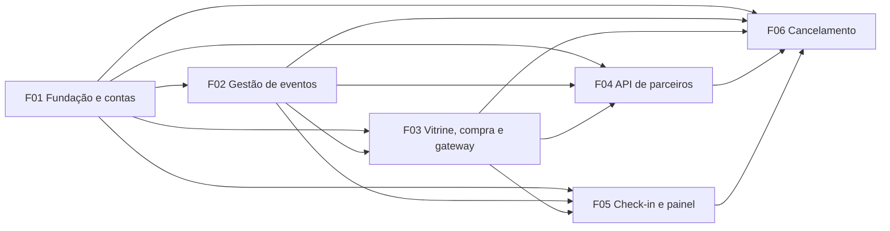

# PRD — Catraca

> Fonte da verdade do projeto (ver `AGENTS.md`). Rastreia as regras R01–R13 e o fluxo do avaliador de `docs/brief.md`.
> IDs de critério são estáveis: nunca renumere; critério removido vira "(removido)".

## 1. Visão e objetivo

A Catraca vende ingressos para eventos pequenos. O organizador cria e publica eventos, o participante compra na vitrine, parceiros compram por API, o pagamento passa por um gateway simulado assíncrono, e o organizador faz check-in, acompanha o painel e pode cancelar o evento (com estorno automático).

**Objetivo desta entrega:** o fluxo do avaliador (passos 1–18 do brief) passa de ponta a ponta numa máquina limpa com Docker, sem ajustes manuais, e cada regra R01–R13 vale também quando as features se encontram.

## 2. Personas

| Persona | Como se identifica | O que faz |
|---|---|---|
| Visitante | sem sessão | vê a vitrine e a página pública dos eventos à venda; ao tentar comprar, vai para o login |
| Participante | conta criada em `/signup` (nome, e-mail, senha) | entra, sai, compra (1 ingresso por compra), vê "Meus ingressos" |
| Organizador | conta da seed (não há cadastro) | cria, edita, publica, cancela os **próprios** eventos; faz check-in; vê o painel |
| Parceiro | cabeçalho `X-Api-Key` | lista eventos à venda, compra e consulta ingressos pela API de contrato fixo |

## 3. Glossário

| Rótulo (interface) | Valor (API e banco) | Quando | Ocupa vaga (R05)? |
|---|---|---|---|
| pendente | `pending` | compra criada, aguardando o gateway | sim |
| confirmado | `confirmed` | gateway aprovou | sim |
| recusado | `declined` | gateway recusou | não |
| cancelado | `cancelled` | estava pendente quando o evento foi cancelado | não |
| estornado | `refunded` | estava confirmado quando o evento foi cancelado | não |

- **Check-in** não é status: coluna `tickets.checked_in` (API: `checkedIn`).
- **Status do evento**: `draft` (rascunho), `published` (publicado), `cancelled` (cancelado). "À venda" = `published`.
- **Vagas ocupadas** = pendentes + confirmados; **vagas disponíveis** = lotação − ocupadas (R05).
- **Canal**: `web` (vitrine) ou `partner` (API).
- **Página de gestão**: `/org/events/:id` (R04).

## 4. Features

Pastas: `docs/features/F01-fundacao-contas`, `F02-gestao-eventos`, `F03-vitrine-compra-gateway`, `F04-api-parceiros`, `F05-checkin-painel`, `F06-cancelamento-evento`.

| ID | Nome | Descrição | Provides (interfaces concretas) | Consumes |
|---|---|---|---|---|
| F01 | Fundação e contas | Harness, Compose, migrações, seed, layout, contas e sessão | `scripts/up.sh`, `scripts/down.sh`, `scripts/gates.sh`; `docker-compose.yml` (app + Postgres 17, `TZ`, `PARTNER_API_KEY`, `SESSION_SECRET`); `GET /health`; runner de migrações (`db/migrations/NNN_*.sql`, tabela `schema_migrations`); `db/migrations/001_users.sql` (tabela `users`: `id`, `name`, `email` único minúsculo, `password_hash`, `role` `participant\|organizer`); `src/db.js` (`pool`, `withTransaction(fn)`); `src/seed.js` (idempotente: organizador A, organizador B, participante); `src/auth.js` (`requireParticipant`, `requireOrganizer`, `req.user`); `src/views/layout.js` (`layout({title, user, body})`, `escapeHtml`); `src/ids.js` (`newId(prefix)`); `src/format.js` (`formatBRL(cents)`, `parseBRL(str)`, `formatDateTime(date)`, `toIsoWithOffset(date)`); `src/messages.js` (todos os textos exatos do brief + rótulos de status); rotas `GET/POST /signup`, `GET/POST /login`, `POST /logout`; `src/app.js` (uma linha de registro por feature); README | — |
| F02 | Gestão de eventos | Área `/org/events`, criar/editar/publicar, página de gestão, ownership | `db/migrations/002_events.sql` (tabela `events`: `id` `evt_…`, `organizer_id`, `name`, `starts_at` timestamptz, `venue`, `capacity` ≥1, `price_cents` >0, `status` `draft\|published\|cancelled`, `created_at`, `updated_at`, `cancelled_at`); `src/features/events/repo.js`: `lockEvent(client, eventId)` (`SELECT … FOR UPDATE`), `getSeatStats(client, eventId)` → `{capacity, occupied, available}`, `getEventForOrganizer(client, eventId, organizerId)` (null se não existe ou não é dono), `listOnSaleEvents(client)`, `getOnSaleEvent(client, eventId)`; `validateEventInput(form)`; rotas `GET /org/events`, `GET /org/events/new`, `POST /org/events`, `GET /org/events/:id`, `POST /org/events/:id/edit`, `POST /org/events/:id/publish`; view da página de gestão com seções extensíveis (`src/features/events/views.js`) | F01 |
| F03 | Vitrine, compra e gateway | Vitrine pública, compra pelo participante, serviço de compra, gateway simulado, Meus ingressos | `db/migrations/003_tickets.sql` (tabela `tickets`: `id` `tkt_…`, `event_id`, `user_id` (nulo no canal partner), `buyer_email`, `code` char(8) único, `status`, `price_cents`, `channel`, `card_last4`, `gateway_outcome` `approved\|declined`, `gateway_due_at`, `checked_in` bool, `checked_in_at`, `created_at`, `updated_at`); `src/features/purchases/service.js`: `purchaseTicket({eventId, buyer:{userId?, email}, cardNumber, channel})` → `{ok:true, ticket}` ou `{ok:false, error:'invalid_request'\|'event_not_available'\|'sold_out'}`; `getTicketById(client, id)`; `generateTicketCode()`; `src/features/gateway/simulator.js` (`decideOutcome(cardNumber)` → `{outcome, delayMs}`); `src/features/gateway/worker.js` (`startGatewayWorker()`, UPDATE condicional); nova implementação de `getSeatStats` (conta `pending`+`confirmed`, mesma assinatura); rotas `GET /`, `GET /events/:id`, `POST /events/:id/purchase`, `GET /me/tickets` | F01, F02 |
| F04 | API de parceiros | As três rotas do contrato fixo | `src/features/partner/` : middleware `requireApiKey`; `GET /api/partner/events`; `POST /api/partner/events/:eventId/purchases`; `GET /api/partner/tickets/:ticketId`; seção da API no README (`$API`, `$KEY`, exemplos `curl`) | F01, F02, F03 |
| F05 | Check-in e painel | Formulário de check-in (R10) e painel (R12) na página de gestão | `src/features/checkin/`: `checkInTicket(client, {eventId, code})` → chave da mensagem; `getEventDashboard(client, eventId)` → `{confirmed, pending, checkIns, available, revenueCents, refunded}`; rota `POST /org/events/:id/checkin`; seções "Check-in" e "Painel" na página de gestão; aviso `Evento cancelado` quando `status='cancelled'` | F01, F02, F03 |
| F06 | Cancelamento de evento | Cancelamento irreversível com estorno/cancelamento imediato dos ingressos | `src/features/cancellation/`: `cancelEvent(client, {eventId, organizerId})`; rota `POST /org/events/:id/cancel`; botão "Cancelar evento" na página de gestão; bloqueio de `POST /org/events/:id/edit` e `/publish` para `cancelled` | F01, F02, F03, F04, F05 |

## 5. Grafo de dependências e waves

Arestas (`Fxx → Fyy` = "Fyy consome de Fxx"):

| Aresta | O que passa |
|---|---|
| F01 → F02 | sessão, `requireOrganizer`, `layout`, `withTransaction`, `newId`, `parseBRL`/`formatDateTime`, runner de migrações |
| F01 → F03 | `requireParticipant`, contas de participante, `layout`, `messages.js` (`Ingressos esgotados`, rótulos) |
| F01 → F04 | app/harness, `PARTNER_API_KEY`, `messages.js` (códigos de erro), `toIsoWithOffset` |
| F01 → F05 | `requireOrganizer`, `messages.js` (mensagens de check-in), `formatBRL` |
| F01 → F06 | `requireOrganizer`, `withTransaction` |
| F02 → F03 | tabela `events`, `lockEvent`, `getSeatStats`, `listOnSaleEvents`, `getOnSaleEvent`, preço vigente |
| F02 → F04 | `listOnSaleEvents`, `getOnSaleEvent`, `getSeatStats` (`availableSeats`) |
| F02 → F05 | página de gestão `/org/events/:id`, `getEventForOrganizer` (ownership 404) |
| F02 → F06 | página de gestão, `getEventForOrganizer`, `lockEvent`, rotas de edição/publicação |
| F03 → F04 | `purchaseTicket` (canal `partner`), `getTicketById`, worker do gateway |
| F03 → F05 | tabela `tickets` (`status`, `price_cents`, `checked_in`, `code`) |
| F03 → F06 | tabela `tickets`, UPDATE condicional do worker, vitrine (`GET /`, `/events/:id`) |
| F04 → F06 | rotas da API (listagem, compra → 404, consulta de ingresso) |
| F05 → F06 | check-in (`Evento cancelado`) e painel (`Estornados`) |

| Wave | Features | Pré-requisito | Entrega |
|---|---|---|---|
| W1 | F01 | — | branch + PR, merge em `main` |
| W2 | F02 | W1 em `main` | branch + PR |
| W3 | F03 | W2 em `main` | branch + PR |
| W4 | F04 ‖ F05 | W3 em `main` | **duas branches e dois PRs independentes**, em paralelo |
| W5 | F06 | W4 (ambos) em `main` | branch + PR |

**Por que W4 é paralela:** não há aresta entre F04 e F05; ambas só consomem F01–F03, já em `main`. Elas não compartilham arquivos: F04 vive em `src/features/partner/`, F05 em `src/features/checkin/` + seções da view de gestão (que F04 não toca). Nenhuma das duas cria migração (`checked_in` e `price_cents` já existem desde F03) e todos os textos do brief já estão em `src/messages.js` desde F01. O único ponto comum é uma linha cada em `src/app.js` (conflito trivial). O comportamento conjunto (compra pela API contada no painel) é verificado em X-17 depois do merge das duas.

## 6. Critérios de aceite por feature

Convenções: "teste" = `node:test` + `fetch` contra o app real em `./scripts/gates.sh`; "fluxo" = verificação manual com `./scripts/up.sh`. Contas da seed na seção 10. Entre parênteses, as regras cobertas.

### F01 — Fundação e contas

| ID | Critério (verificável) |
|---|---|
| F01-AC01 | Em clone limpo (sem `.env`, sem `npm install` no host), `./scripts/up.sh` builda, sobe app + Postgres, aplica migrações, roda a seed e só retorna quando `curl -fs http://localhost:3000/health` responde 200. |
| F01-AC02 | Seed idempotente: `up` → `down` → `up` não duplica usuários (`SELECT count(*) FROM users WHERE email IN (<3 e-mails da seed>)` = 3) e as três credenciais da seed continuam entrando. |
| F01-AC03 | `./scripts/down.sh` para tudo que a subida iniciou: `curl http://localhost:3000/health` falha e `docker compose ps -q` (projeto do app) sai vazio; o volume do banco é mantido. |
| F01-AC04 | `./scripts/gates.sh` roda `node --check` em `src/` e `test/` e `node --test` num projeto Compose separado (`catraca-gates`, banco de teste próprio), sai 0 quando tudo passa e ≠0 se um teste falha, e ao final não restam containers/volumes desse projeto. |
| F01-AC05 | `POST /signup` com nome, e-mail válido e senha (≥6) cria `users.role='participant'`, guarda só hash bcrypt (`password_hash` começa com `$2`), abre sessão e redireciona para `/`; o layout passa a mostrar o nome e "Sair". |
| F01-AC06 | Cadastro rejeitado (status 422, formulário reexibido, nenhum usuário criado) para: nome vazio, e-mail fora de `^[^\s@]+@[^\s@]+\.[^\s@]+$`, e-mail já cadastrado (comparação sem maiúsculas/espaços), senha com menos de 6 caracteres. |
| F01-AC07 | `POST /login` correto abre sessão (organizador → `/org/events`; participante → `/` ou `next`); incorreto mostra `E-mail ou senha inválidos` sem sessão. `POST /logout` encerra a sessão: em seguida `GET /org/events` redireciona ao login. |
| F01-AC08 | Não há cadastro de organizador: `POST /signup` com campo extra `role=organizer` cria participante; não existe rota de cadastro de organizador. |
| F01-AC09 | Guardas: em `/org/*`, visitante recebe 302 para `/login?next=…`; participante recebe 403 com página sem dados de evento; organizador passa. Em rotas de participante, visitante → 302 `/login?next=…`, organizador → 403. (R13) |
| F01-AC10 | Toda página HTML usa `layout` (nav com Entrar/Criar conta ou nome + Sair) e valores dinâmicos passam por `escapeHtml`: participante com nome `` aparece escapado. |
| F01-AC11 | `src/messages.js` exporta, com texto idêntico ao brief: `Ingressos esgotados`; as 5 mensagens de R10; `unauthorized`, `invalid_request`, `event_not_available`, `sold_out`, `ticket_not_found`; rótulos pendente/confirmado/recusado/cancelado/estornado. Teste compara as strings literalmente. |
| F01-AC12 | README traz: comando de subida/derrubada/gates, `$WEB` = `$API` = `http://localhost:3000`, credenciais da seed, a chave de parceiro padrão, mapa dos artefatos. `up.sh` repassa o fuso do host ao container como `TZ` (fallback `America/Sao_Paulo`). |

### F02 — Gestão de eventos

| ID | Critério (verificável) |
|---|---|
| F02-AC01 | Organizador cria evento com nome, início (futuro), local, lotação e preço: linha em `events` com `status='draft'`, `id` em `^evt_[a-z0-9]{10}$`, `organizer_id` do usuário logado; redireciona para `/org/events/:id`. (R01, R02, R04) |
| F02-AC02 | Criação rejeitada (422, form reexibido com erro, nenhuma linha criada) para: nome ou local vazio; lotação não inteira ou < 1; preço vazio, não numérico, ≤ 0 ou com mais de 2 casas; início vazio, no passado ou igual a agora (ex.: ontem). (R01) |
| F02-AC03 | Preço aceita `100`, `100,00`, `100.00`, `R$ 100,00`, `150,5` → `price_cents` 10000/10000/10000/10000/15050; rejeita `1.234,56`, `10,123`, `abc`, `-5`, `0`. (R01) |
| F02-AC04 | `GET /org/events` lista só eventos com `organizer_id` do logado (nome, início, rótulo de status, link para a gestão): A não vê eventos de B e vice-versa. (R13) |
| F02-AC05 | `GET /org/events/:id` (dono) mostra os dados, o formulário de edição e, se rascunho, o botão "Publicar"; a URL é estável e reabrível diretamente. (R04) |
| F02-AC06 | `POST /org/events/:id/publish` muda `draft`→`published`; repetir não altera nada nem dá erro. (R02) |
| F02-AC07 | `POST /org/events/:id/edit` (rascunho ou publicado) aplica as mesmas validações de F02-AC02/AC03, inclusive início no futuro; edição inválida não altera a linha. (R01) |
| F02-AC08 | A edição roda em `withTransaction`, começa com `lockEvent` e rejeita `capacity < getSeatStats(client,id).occupied` com `A lotação não pode ser menor que as vagas ocupadas (N)`, sem alterar o evento. `getSeatStats` de um evento sem vendas retorna `{capacity, occupied:0, available:capacity}`. (R03, R05) |
| F02-AC09 | Organizador B em `GET /org/events/<id de A>`, `POST …/edit` e `POST …/publish` recebe 404 `Evento não encontrado` (idêntico a id inexistente); o corpo não contém nome, local nem id do evento de A; o banco não muda. (R13) |
| F02-AC10 | `listOnSaleEvents` / `getOnSaleEvent` retornam só `status='published'` (rascunho e `cancelled` — este posto via SQL no teste — ficam de fora), ordenados por `starts_at`. (R02) |
| F02-AC11 | Datas: o campo `datetime-local` é interpretado no `TZ` do container e exibido como `dd/mm/aaaa HH:mm`; criar com a hora atual + 1 min é aceito e com a hora atual − 1 min é rejeitado. (R01) |

### F03 — Vitrine, compra e gateway

| ID | Critério (verificável) |
|---|---|
| F03-AC01 | `GET /` (visitante, participante ou organizador) lista os eventos de `listOnSaleEvents` com nome, início, local e preço (`R$ 100,00`); rascunho e cancelado não aparecem. Evento esgotado continua listado. (R02) |
| F03-AC02 | `GET /events/:id` de evento à venda mostra detalhes, vagas disponíveis e, para participante, o formulário com número do cartão; para visitante, link "Entrar para comprar" → `/login?next=/events/:id`. Rascunho, cancelado ou inexistente → 404. (R02) |
| F03-AC03 | Participante compra com cartão de 16 dígitos: `tickets` ganha 1 linha `pending`, `channel='web'`, `user_id` do comprador, `price_cents` = preço vigente do evento, `code` em `^[A-Z0-9]{8}$`, só `card_last4` guardado; a resposta (redirect para `/me/tickets`) chega sem esperar o gateway (< 1 s) e mostra "pendente". (R03, R06, R09) |
| F03-AC04 | Cartão fora de `^\d{16}$` (espaços removidos na vitrine) é rejeitado com mensagem e nenhum ingresso é criado (contagem de `tickets` igual). (R06) |
| F03-AC05 | Com vagas disponíveis = 0, `/events/:id` mostra `Ingressos esgotados` no lugar do formulário, e um `POST /events/:id/purchase` responde com `Ingressos esgotados` sem criar ingresso. (R07) |
| F03-AC06 | Gateway com atrasos padrão: final `0001` → `confirmed` em ≤ 5 s (e `pending` visível nos ~2 s anteriores); `0002` e qualquer outro final → `declined` em ≤ 5 s; `0003` → `confirmed` e `0004` → `declined` entre 60 e 75 s (padrão 65 s). Teste roda com `GATEWAY_FAST_DELAY_MS`/`GATEWAY_SLOW_DELAY_MS` reduzidos; os padrões são verificados por teste unitário de `decideOutcome`. (R08) |
| F03-AC07 | `getSeatStats` conta `pending`+`confirmed`: compra recusada libera a vaga (available volta a subir); `cancelled`/`refunded`/`declined` não contam. (R05, R08) |
| F03-AC08 | 30 chamadas simultâneas de `purchaseTicket` (`Promise.all`) num evento de lotação 5 → exatamente 5 `ok` e 25 `sold_out`; `pending+confirmed` nunca passa de 5. Repetido 2× em eventos novos. (R07) |
| F03-AC09 | O worker só altera ingresso `pending`: ingresso colocado em `cancelled` (via SQL) antes do vencimento continua `cancelled` depois que `gateway_due_at` passa. (R11) |
| F03-AC10 | A resposta do gateway sobrevive a reinício: ingresso `pending` com `gateway_due_at` futuro é resolvido depois de `down`+`up` do app (o vencimento está no banco, não em memória). (R08) |
| F03-AC11 | `GET /me/tickets` mostra, para cada ingresso do participante logado (e só os dele), o nome do evento, o rótulo de status e o código; recarregar mostra o status novo. Visitante → login. (R09) |
| F03-AC12 | `tickets.code` tem restrição `UNIQUE`; `generateTicketCode` tenta de novo em colisão; ids em `^tkt_[a-z0-9]{10}$`. (R09) |
| F03-AC13 | Só participante compra na vitrine: organizador em `POST /events/:id/purchase` recebe 403 sem criar ingresso; visitante é redirecionado ao login. (R06) |

### F04 — API de parceiros

| ID | Critério (verificável por `curl`) |
|---|---|
| F04-AC01 | Nas 3 rotas, sem `X-Api-Key` ou com chave errada: `401` e corpo exatamente `{"error":"unauthorized"}`, antes de qualquer outra validação. |
| F04-AC02 | `GET /api/partner/events` → `200`, array só com eventos à venda; cada item tem exatamente `id`, `name`, `startsAt` (ISO 8601 com offset do `TZ`, ex. `2026-12-05T21:00:00-03:00`), `priceCents` (inteiro) e `availableSeats` = vagas disponíveis de R05 (0 quando esgotado, e o evento continua listado). (R02, R05) |
| F04-AC03 | `POST /api/partner/events/:id/purchases` válido → `202` `{"ticketId":"tkt_…","code":"XXXXXXXX","status":"pending"}`; ingresso com `channel='partner'`, `buyer_email` gravado, `user_id` nulo; resposta sem esperar o gateway. (R06) |
| F04-AC04 | `422 {"error":"invalid_request"}` para: corpo não-JSON ou não-objeto, `buyerEmail` ou `cardNumber` ausente, e-mail fora do regex, `cardNumber` fora de `^\d{16}$` (ex. `"123"`); vale também para evento inexistente (422 vem antes de 404). |
| F04-AC05 | `404 {"error":"event_not_available"}` para evento inexistente, rascunho ou `cancelled` (via SQL no teste), mesmo que sem vagas (404 vem antes de 409). (R02) |
| F04-AC06 | Evento sem vaga → `409 {"error":"sold_out"}` sem criar ingresso. (R07) |
| F04-AC07 | 30 compras simultâneas via `seq 30 \| xargs -P 30 curl …` num evento de lotação 5 → exatamente `5 202` e `25 409`; repetido num segundo evento, mesmo resultado. (R07) |
| F04-AC08 | `GET /api/partner/tickets/:id` → `200 {"ticketId","code","eventId","status","checkedIn"}` (`checkedIn` booleano) para ingresso de qualquer canal; id inexistente → `404 {"error":"ticket_not_found"}`. (R09) |
| F04-AC09 | Compra com final `0004` fica `pending` por ≥ 60 s e vira `declined` até 75 s; nesse momento `availableSeats` sobe 1. (R05, R08) |
| F04-AC10 | Toda resposta da API é `application/json`; compra com `buyerEmail` igual ao de um participante não aparece em "Meus ingressos" dele. (R06) |

### F05 — Check-in e painel

| ID | Critério (verificável) |
|---|---|
| F05-AC01 | A página de gestão `/org/events/:id` tem a seção "Check-in" com campo de código e `POST /org/events/:id/checkin`; o código é normalizado (trim + maiúsculas) e a mensagem resultante aparece na página. (R04, R10) |
| F05-AC02 | Código inexistente (`ZZZZZZZZ`) ou de outro evento (inclusive de outro organizador) → `Ingresso inválido para este evento`, mesmo se o evento estiver cancelado (linha 1 antes da 2). (R10) |
| F05-AC03 | Evento `cancelled` (via SQL no teste) + código do evento (qualquer status) → `Evento cancelado` (linha 2 antes da 3). (R10) |
| F05-AC04 | Ingresso `pending`, `declined`, `cancelled` ou `refunded` de evento não cancelado → `Ingresso não confirmado`. (R10) |
| F05-AC05 | Ingresso `confirmed` com `checked_in=true` → `Ingresso já utilizado`. (R10) |
| F05-AC06 | Ingresso `confirmed` sem check-in → `Entrada liberada` e `checked_in=true`, `checked_in_at` preenchido (UPDATE condicional `WHERE checked_in=false`); duas submissões simultâneas do mesmo código dão exatamente um `Entrada liberada` e um `Ingresso já utilizado`. (R10) |
| F05-AC07 | Seção "Painel" mostra Confirmados (`confirmed`, inclusive com check-in), Pendentes, Check-ins (`confirmed` com `checked_in`), Vagas disponíveis (= `getSeatStats().available`), Receita e Estornados (`refunded`), cada um conferido contra SQL num evento com ingressos em todos os status. (R05, R12) |
| F05-AC08 | Receita = soma de `price_cents` dos `confirmed`, formatada `R$ 350,00`; ingressos de preços diferentes somam cada um pelo seu preço; recusados/pendentes/estornados não entram. (R03, R12) |
| F05-AC09 | Organizador B em `POST /org/events/<id de A>/checkin` → 404 sem dados e nenhum `checked_in` muda; participante → 403; visitante → login. (R13) |
| F05-AC10 | Em evento `cancelled`, a página de gestão exibe o aviso `Evento cancelado` acima do campo; o campo continua ativo e segue a tabela de R10. (R10) |

### F06 — Cancelamento de evento

| ID | Critério (verificável) |
|---|---|
| F06-AC01 | A página de gestão de evento publicado tem o botão "Cancelar evento" (com confirmação); `POST /org/events/:id/cancel` pelo dono deixa `status='cancelled'` e `cancelled_at` preenchido. (R04, R11) |
| F06-AC02 | Na mesma transação (iniciada por `lockEvent`): todos os `confirmed` do evento → `refunded` e todos os `pending` → `cancelled`; imediatamente após a resposta, nenhum ingresso do evento está `pending`/`confirmed`. (R11) |
| F06-AC03 | Irreversível: a gestão do evento cancelado não mostra formulário de edição, botão Publicar nem Cancelar; `POST …/edit`, `…/publish` e `…/cancel` respondem com erro e não alteram a linha. (R11) |
| F06-AC04 | Evento cancelado some de `GET /` e `/events/:id` (404); tentativa de compra na vitrine é rejeitada; ingressos do participante aparecem em "Meus ingressos" como estornado/cancelado. (R02, R09, R11) |
| F06-AC05 | Resposta tardia do gateway não muda nada: ingresso `0003`/`0004` que estava pendente continua `cancelled` 75 s depois da compra. (R11) |
| F06-AC06 | Rascunho não é cancelável: sem botão; `POST …/cancel` em rascunho responde `Só eventos publicados podem ser cancelados` sem alterar a linha. |
| F06-AC07 | Organizador B em `POST /org/events/<id de A>/cancel` → 404, evento intacto; participante → 403; visitante → login. (R13) |
| F06-AC08 | Cancelamento concorrente com 30 compras pela API: ao final, nenhum ingresso do evento está `pending`/`confirmed` e as compras que perderam a corrida responderam `404 event_not_available`; ocupadas nunca passaram da lotação. (R07, R11) |

## 7. Critérios cross-feature

Cada aresta do grafo tem pelo menos um critério X, que entra no `contract.md` da feature indicada (por padrão a consumidora) e vira teste automatizado nos gates.

| ID | Aresta | Critério ("o que Fxx provê chega e funciona em Fyy") | Contrato |
|---|---|---|---|
| X-01 | F01 → F02 | Os guardas de F01 protegem as rotas de F02: visitante em `/org/events/:id` → 302 login; participante da seed → 403 sem nome/local/id do evento. (R13) | F02 |
| X-02 | F01 → F02 | Organizador A da seed, logado pelo `/login` de F01, cria evento cujo `organizer_id` é o id de A; após logout, a gestão não abre. | F02 |
| X-03 | F01 → F03 | Participante recém-criado em `/signup` compra e vê o ingresso em "Meus ingressos"; visitante que clica em comprar vai a `/login?next=/events/:id` e, após entrar, volta à página do evento. (R06, R09) | F03 |
| X-04 | F02 → F03 | Evento criado em F02 só aparece na vitrine depois de publicado; mudar o preço em F02 de R$ 100,00 para R$ 150,00 não altera `price_cents` dos ingressos já comprados e a compra seguinte grava 15000. (R02, R03) | F03 |
| X-05 | F02 → F03 | Com 2 ingressos reais ocupando vaga, editar a lotação para 1 em F02 é rejeitado; para 3 é aceito e libera mais uma compra. (R03, R05) | F03 |
| X-06 | F01 → F04 | A API roda no harness de F01: após `./scripts/up.sh`, a chave do README dá 200 em `GET /api/partner/events`; os testes de F04 rodam em `./scripts/gates.sh`; os códigos de erro vêm de `messages.js`. | F04 |
| X-07 | F02 → F04 | Rascunho de F02 não aparece na listagem e compra nele dá 404; após publicar, aparece com `availableSeats` = lotação e `priceCents` = preço; editar preço/lotação reflete na listagem. (R02, R05) | F04 |
| X-08 | F03 → F04 | Compra pela API passa por `purchaseTicket`: ocupa vaga também na vitrine (`Ingressos esgotados` quando a API esgota), o worker resolve ingressos `partner` (`0001` → `confirmed` em ≤ 5 s), `0004` libera a vaga ao ser recusado e `GET /api/partner/tickets/:id` lê ingresso comprado na vitrine. (R05, R06, R07, R08) | F04 |
| X-09 | F01 → F05 | As mensagens exibidas no check-in são as de `messages.js` (comparação literal); participante em `POST …/checkin` → 403. | F05 |
| X-10 | F02 → F05 | Check-in e painel aparecem na página de gestão de F02; o ownership de F02 vale para eles: B não vê painel nem consegue check-in em evento de A (404). (R04, R13) | F05 |
| X-11 | F03 → F05 | Ingresso comprado na vitrine e confirmado pelo worker dá `Entrada liberada`; o de final `0004` pendente dá `Ingresso não confirmado`; ingressos `channel='partner'` (criados via `purchaseTicket`) entram no painel; com preços 100, 100 e 150 confirmados, Receita = `R$ 350,00`. (R03, R10, R12) | F05 |
| X-12 | F01 → F06 | Os guardas de F01 valem para o cancelamento: visitante e participante não cancelam (login/403) e o evento fica intacto. (R13) | F06 |
| X-13 | F02 → F06 | Após cancelar, as rotas de edição/publicação de F02 recusam o evento e `listOnSaleEvents` não o retorna; a lista `/org/events` do dono mostra "cancelado". (R02, R11) | F06 |
| X-14 | F03 → F06 | Ingressos de F03 transitam no cancelamento (`confirmed`→`refunded`, `pending`→`cancelled`); o UPDATE condicional do worker mantém `cancelled` após o vencimento; a vitrine para de vender; "Meus ingressos" mostra estornado. (R09, R11) | F06 |
| X-15 | F04 → F06 | Após cancelar: o evento some de `GET /api/partner/events`, compra dá `404 event_not_available`, `GET /api/partner/tickets` mostra `refunded`/`cancelled` em ≤ 10 s e o `cancelled` persiste 75 s após a compra. (R11) | F06 |
| X-16 | F05 → F06 | Após cancelamento real (não via SQL): check-in de código confirmado→estornado dá `Evento cancelado`; painel mostra Confirmados 0, Pendentes 0, Check-ins 0, Receita `R$ 0,00`, Estornados = nº de confirmados antes do cancelamento. (R10, R11, R12) | F06 |
| X-17 | F04 ‖ F05 (integração da W4, sem aresta) | Compras feitas por HTTP na API de F04 aparecem no painel de F05 e seus códigos fazem check-in: 30 compras simultâneas (`0001`) num evento de lotação 5 → em ≤ 10 s o painel mostra Confirmados 5 e Vagas disponíveis 0; o código de uma delas dá `Entrada liberada`. (R07, R10, R12) | F06 (primeira feature que consome F04 e F05); executado também após o merge do segundo PR da W4 |

| Aresta | Critérios X |
|---|---|
| F01 → F02 | X-01, X-02 |
| F01 → F03 | X-03 |
| F01 → F04 | X-06 |
| F01 → F05 | X-09 |
| F01 → F06 | X-12 |
| F02 → F03 | X-04, X-05 |
| F02 → F04 | X-07 |
| F02 → F05 | X-10 |
| F02 → F06 | X-13 |
| F03 → F04 | X-08 |
| F03 → F05 | X-11 |
| F03 → F06 | X-14 |
| F04 → F06 | X-15 |
| F05 → F06 | X-16 |
| F04 + F05 (integração) | X-17 |

### Critérios de processo (passo 18)

| ID | Critério |
|---|---|
| P-01 | Cada feature tem `docs/features/<ID>-<slug>/spec.md`, `plan.md`, `contract.md`; o contrato lista os IDs `Fxx-ACnn` e `X-nn` que cobre, cada um com o comando/teste que o verifica. |
| P-02 | Cada avaliação é um arquivo novo `reports/AAAA-MM-DD-HHMM-avaliacao.md`, escrito por agente diferente do implementador; `git log --format="%h %ad" --date=iso -- <relatório>` mostra um único commit. |
| P-03 | `state.json` registra, por feature, o status e o caminho do relatório mais recente, coerente com os relatórios commitados. |
| P-04 | F04 e F05 foram entregues em branches e PRs separados, abertos em paralelo, cada um com gates passando. |
| P-05 | `AGENTS.md` e README apontam para PRD, features, estado, scripts e seed (mapa navegável). |

## 8. Matriz de rastreabilidade R01–R13

| Regra | Critérios |
|---|---|
| R01 | F02-AC01, F02-AC02, F02-AC03, F02-AC07, F02-AC11 |
| R02 | F02-AC01, F02-AC06, F02-AC10, F03-AC01, F03-AC02, F04-AC02, F04-AC05, F06-AC04, X-04, X-07, X-13 |
| R03 | F02-AC08, F03-AC03, F05-AC08, X-04, X-05, X-11 |
| R04 | F02-AC01, F02-AC05, F05-AC01, F06-AC01, X-10 |
| R05 | F02-AC08, F03-AC07, F04-AC02, F04-AC09, F05-AC07, X-05, X-07, X-08 |
| R06 | F03-AC03, F03-AC04, F03-AC13, F04-AC03, F04-AC10, X-03, X-08 |
| R07 | F03-AC05, F03-AC08, F04-AC06, F04-AC07, F06-AC08, X-08, X-17 |
| R08 | F03-AC06, F03-AC07, F03-AC10, F04-AC09, X-08 |
| R09 | F03-AC03, F03-AC11, F03-AC12, F04-AC08, F06-AC04, X-03, X-14 |
| R10 | F05-AC01 a F05-AC06, F05-AC10, X-11, X-16, X-17 |
| R11 | F03-AC09, F06-AC01 a F06-AC05, F06-AC08, X-13, X-14, X-15, X-16 |
| R12 | F05-AC07, F05-AC08, X-11, X-16, X-17 |
| R13 | F01-AC09, F02-AC04, F02-AC09, F05-AC09, F06-AC07, X-01, X-10, X-12 |

## 9. Fluxo do avaliador → critérios

| Passo | O que verifica | Critérios |
|---|---|---|
| 1 | subida limpa com seed | F01-AC01, F01-AC12 |
| 2 | E1 rascunho fora da vitrine e da API | F02-AC01, F02-AC10, F03-AC01, F04-AC02, X-07 |
| 3 | data de ontem rejeitada | F02-AC02, F02-AC11 |
| 4 | publicar; `availableSeats` 2, `priceCents` 10000 | F02-AC06, F03-AC01, F04-AC02, X-04, X-07 |
| 5 | conta nova, compra `0001`, pendente → confirmado | F01-AC05, F03-AC03, F03-AC06, F03-AC11, X-03 |
| 6 | compra API `0004` → 202 pending, `availableSeats` 0 | F04-AC03, F04-AC02, X-08 |
| 7 | `sold_out` na API e `Ingressos esgotados` na vitrine | F04-AC06, F03-AC05, X-08 |
| 8 | T2 `declined`, vaga volta; T3 `confirmed` | F03-AC06, F04-AC08, F04-AC09, X-08 |
| 9 | lotação 1 rejeitada; preço 150 + lotação 3; painel 3/0/0/0/R$ 350,00/0 | F02-AC07, F02-AC08, X-05, X-04, F05-AC07, F05-AC08, X-11, X-17 |
| 10 | check-in C1, C1, C2, `ZZZZZZZZ`; Check-ins 1 | F05-AC01, F05-AC02, F05-AC04, F05-AC05, F05-AC06, X-11, X-17 |
| 11 | B não vê E1 (lista e URL); E2 de B; participante/visitante sem dados; C3 inválido em E1 | F02-AC04, F02-AC09, F01-AC09, X-01, X-10, X-07, X-08, F05-AC02 |
| 12 | E3, T5 (`0003`), T6 (`0001`), cancelamento | F06-AC01, F06-AC02, X-14 |
| 13 | E3 fora da vitrine/API, 404 na compra; T6 `refunded`, T5 `cancelled`; sem edição | F06-AC02, F06-AC03, F06-AC04, X-13, X-15 |
| 14 | T5 continua `cancelled` após 75 s; `Evento cancelado`; painel 0/0/0/R$ 0,00/1 | F06-AC05, X-14, X-15, X-16 |
| 15 | 30 simultâneas → 5×202 + 25×409; painel Confirmados 5, Vagas 0; repetir em E5 | F03-AC08, F04-AC07, X-17 |
| 16 | 401 nas 3 rotas; `422` com cartão `123`; `404 ticket_not_found` | F04-AC01, F04-AC04, F04-AC08 |
| 17 | gates passam; down limpa; up de novo com seed | F01-AC02, F01-AC03, F01-AC04 |
| 18 | PRD, spec/plano/contrato, relatórios imutáveis, estado, PRs paralelos | P-01 a P-05 |

## 10. Decisões técnicas transversais

| Tema | Decisão |
|---|---|
| Concorrência (R07, R03, R11) | Compra, edição de lotação e cancelamento rodam em `withTransaction` que começa com `lockEvent` = `SELECT … FROM events WHERE id=$1 FOR UPDATE`; vagas são calculadas por `getSeatStats` dentro dessa trava. Nada decide compra fora dela. |
| Gateway | Na compra, `decideOutcome` define `gateway_outcome` e `gateway_due_at = now() + delay`, gravados no ingresso (estado no banco ⇒ worker persistente). O worker, no processo do app, faz polling a cada `GATEWAY_POLL_MS` (padrão 500 ms) e aplica `UPDATE tickets SET status=$2, updated_at=now() WHERE id=$1 AND status='pending'`. |
| Atrasos do gateway | `GATEWAY_FAST_DELAY_MS` padrão 2000 (finais `0001`, `0002`, outros); `GATEWAY_SLOW_DELAY_MS` padrão 65000 (`0003`, `0004`). Valores menores só por env, nos testes. |
| Preço | `events.price_cents` inteiro; na compra copia-se para `tickets.price_cents`; Receita soma o valor do ingresso. |
| IDs e códigos | `evt_` / `tkt_` + 10 caracteres `[a-z0-9]` (`newId(prefix)`, `crypto.randomInt`); código do ingresso: 8 caracteres `[A-Z0-9]`, `UNIQUE`, nova tentativa em colisão. |
| Cartão | Validado como `^\d{16}$` antes de criar o ingresso; só os 4 últimos dígitos são persistidos. |
| Check-in | UPDATE condicional `WHERE id=$1 AND checked_in=false` para impedir duplo `Entrada liberada`. |
| Textos | Todos os textos do brief em `src/messages.js` (F01); features não os reescrevem. |
| Rotas e conflitos | Cada feature em `src/features/<area>/`, uma linha em `src/app.js`; migrações numeradas na ordem das waves (001 F01, 002 F02, 003 F03; F04/F05 sem migração; F06 só se precisar, no próximo número livre). |
| Fuso | `up.sh` detecta o fuso do host e o passa como `TZ` ao container (fallback `America/Sao_Paulo`); `starts_at` é `timestamptz`; a API usa `toIsoWithOffset`. |
| Contas da seed | Organizador A `org.a@catraca.local`, organizador B `org.b@catraca.local`, participante `participante@catraca.local`, todos com senha `catraca123` (documentados no README). |
| Chave de parceiro | `PARTNER_API_KEY`, padrão `catraca-parceiro-2026` no Compose, documentada no README. |

## 11. Decisões para pontos vagos do brief

| Ponto | Decisão |
|---|---|
| Formato do preço | Digitado em reais, `R$` e espaços opcionais, vírgula ou ponto decimal, até 2 casas, sem separador de milhar; > 0. Exibido `R$ 1.234,56`. |
| E-mail válido | `^[^\s@]+@[^\s@]+\.[^\s@]+$` após trim; guardado em minúsculas. Vale para cadastro e `buyerEmail`. |
| Senha | Mínimo 6 caracteres. |
| "Data no futuro" | `starts_at > now()` no momento de salvar (criar e editar), no `TZ` do container. |
| Visitante clica em comprar | Redirecionado a `/login?next=/events/:id`; após login volta ao evento. |
| R13 "não acessa" | Visitante → 302 para o login; participante → 403; nunca veem dados. Outro organizador → 404 idêntico ao de evento inexistente. |
| Pendente observável (passo 5) | Atraso padrão de aprovação/recusa rápida ≈ 2 s; após comprar, o participante cai em "Meus ingressos" e vê "pendente". |
| Janela 60–75 s | Atraso lento padrão 65 s: margem para o passo 7 (< 60 s) e o passo 8 (≥ 75 s). |
| Evento esgotado | Continua na vitrine (com `Ingressos esgotados`) e na API (`availableSeats: 0`). |
| Edição de publicado | Permitida (todos os campos, mesmas validações) até o cancelamento. |
| Cancelar rascunho | Não suportado (sem botão; POST rejeitado). |
| Prazo de 10 s do R11 | O cancelamento muda os ingressos na mesma transação (imediato). |
| Check-in em evento cancelado | O campo continua visível com aviso `Evento cancelado`; a tabela de R10 vale na ordem (código de outro evento ainda dá `Ingresso inválido…`). |
| Vagas disponíveis de evento cancelado | Aplicada R05 literalmente (lotação − pendentes − confirmados). |
| Código digitado no check-in | Trim + maiúsculas antes de comparar. |
| Cartão na vitrine | Espaços removidos antes de validar; na API, `cardNumber` precisa ser string de exatamente 16 dígitos. |
| Compra por organizador na vitrine | Proibida (403); só participante compra pela vitrine. |
| Compra pela API e contas | Não vincula a participante, mesmo com e-mail igual. |
| Eventos com data já passada | Continuam à venda se publicados (encerramento automático fora de escopo). |
| Login | Uma única tela `/login` para participante e organizador; o papel vem de `users.role`. |
| `$WEB` e `$API` | Mesmo endereço: `http://localhost:3000`. |

## 12. Fora de escopo

- Deploy e qualquer ambiente além do local.
- Gateway real, e-mail e notificações.
- App mobile e qualidade visual (nenhum critério avalia design).
- Cadastro de organizador pelo produto.
- Mais de um ingresso por compra, mapa de assentos, cancelamento ou transferência de ingresso pelo participante.
- Atualização em tempo real (recarregar a página basta).
- Fuso horário configurável (datas no horário local da máquina).
- **Decididos aqui:** cancelamento de rascunho; exclusão de evento; reversão de cancelamento; reembolso parcial; encerramento automático de vendas após o início do evento; desfazer check-in; recuperação de senha; edição de perfil; mais de uma chave de parceiro; paginação da vitrine e da API; múltiplas instâncias do app (o worker assume uma).
